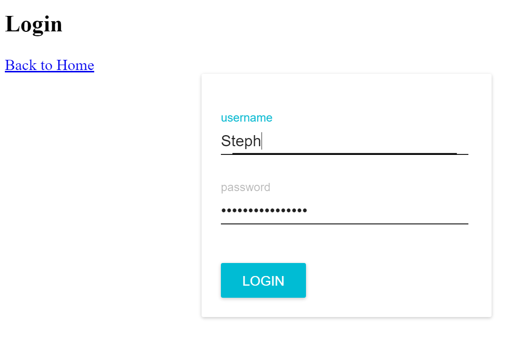
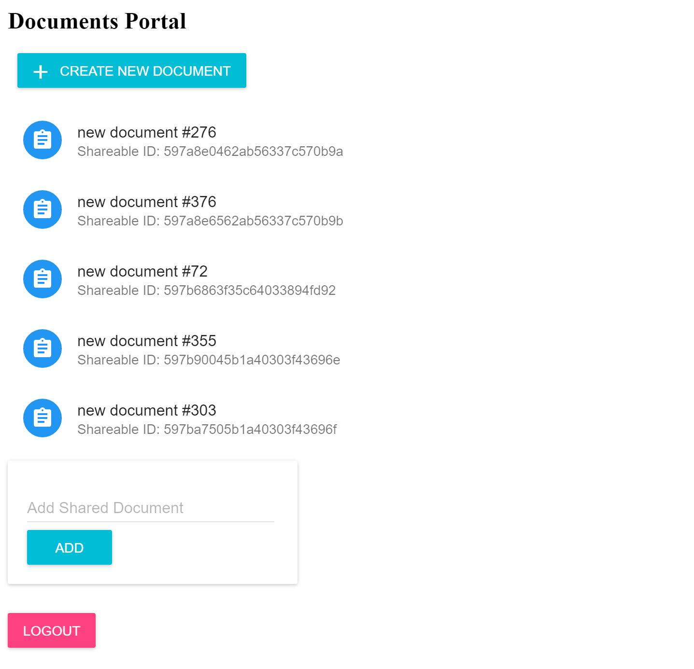
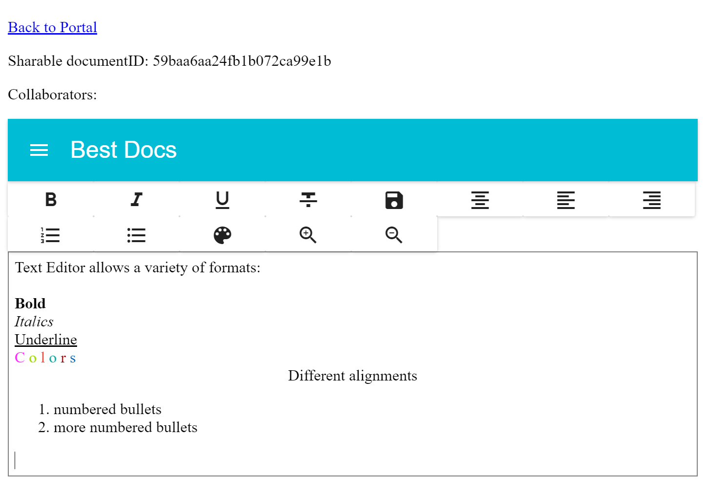
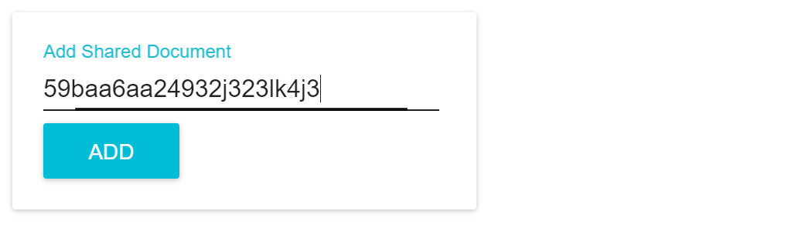

# Docs

Desktop Google Docs

## Project Purpose

Needed a project to learn desktop development with. So I built this with team.

## How it works

1. Log in with unique account

2. Documents listed in dashboard

3. Edit Documents

4. Work together with other users

## Key Tools

Electron, React

## Acknowledgments

* James Chen
* David Huang
* Horizons School of Technology
